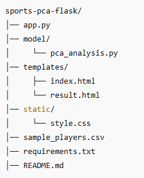
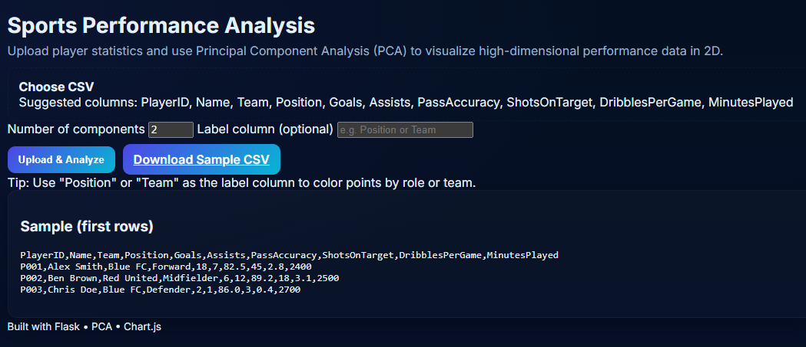
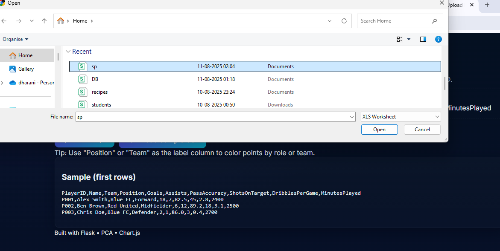
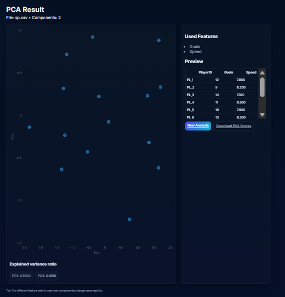

# Sports Performance Analysis using PCA (Flask)

## Overview
--------
This web application allows you to upload player performance data and visualize principal components using PCA. The app reduces multiple performance features into low dimensional axes that help interpret player strengths and similarities.

## Features
--------
- Upload CSV of player stats
- Choose or auto-select numeric features
- Compute PCA and visualize PC1 vs PC2
- View explained variance ratio
- Download PCA scores (CSV)

### Installation
------------
1. Clone the repo:

git clone https://github.com/your-username/sports-pca-flask.git
cd sports-pca-flask

2. Create and activate virtual environment:
python -m venv venv
source venv/bin/activate # Windows: venv\Scripts\activate

3. Install dependencies:
pip install -r requirements.txt

## Running
-------
1. Start the app:
python app.py

2. Open browser:
http://127.0.0.1:5000

3. CSV Format
----------
Include a player/name column and numeric stat columns. Example:
Player,Goals,Assists,Shots,PassAccuracy,Speed,Stamina,Tackles
Ronaldo,30,6,120,82,33,88,14
...

## How to run

Create the folder structure and save the files above.

## Create a python virtual environment and install dependencies:

python -m venv venv
source venv/bin/activate   # Windows: venv\Scripts\activate
pip install -r requirements.txt

## Run:

python app.py
Visit http://127.0.0.1:5000, upload sample_players.csv (or your CSV) and explore.

## SRUCTURE

## INPUT

## UPLOAD FILE

## OUTPUT

## AUTHOR
R.DHARANI SRI
